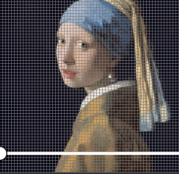
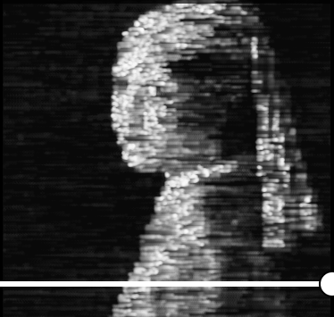
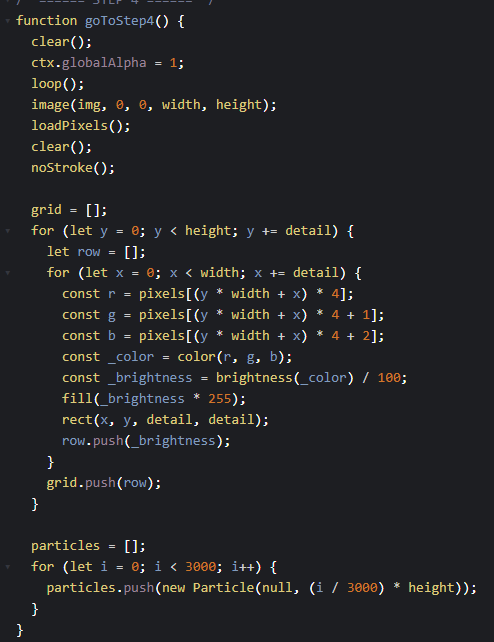
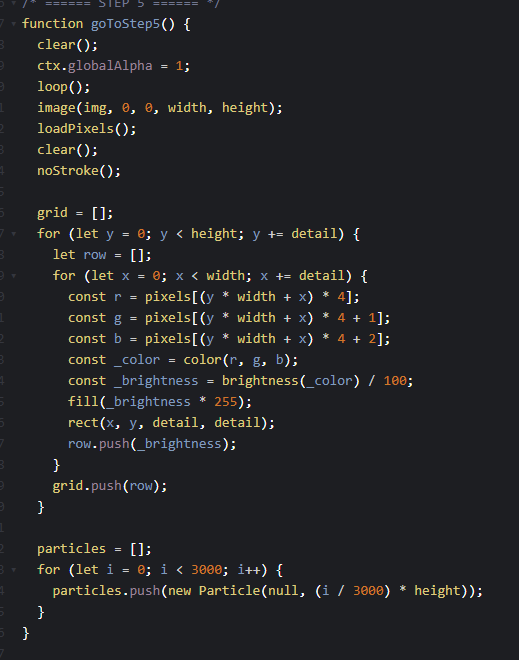

# Part 1: Imaging Technique Inspiration
I found the particle system in p5.js. It can create dynamic effects similar to pixelation by manipulating the properties and positions of particles. This technique helps me to add animation to the pixelated effect of an image. 
In this technique, the image is split into multiple particles. Each particle can be moved according to its brightness and position. By gradually adjusting the transparency, color, or speed of each particle, the image can be made to appear as a one-pixel dynamic effect.

# Part 2: Coding Technique Exploration

I found the particle system in p5.js. It creates dynamic effects similar to pixelation by manipulating the properties and positions of particles. This technique helps me add animation to the pixelated effect of an image. The image is split into multiple particles, and each can move based on brightness and position. Gradually adjusting transparency, color, or speed creates a one-pixel dynamic effect.

Link: [Flowing Image -How To](https://codepen.io/Mamboleoo/pen/GRJKoBw)

